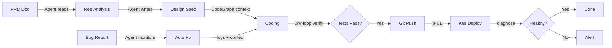

<p align="center">
  
</p>

<p align="center">
  <a href="mailto:coder.wangbin@gmail.com"></a>
  <a href="https://github.com/coder-wangbin"></a>
  
</p>

---

## 👨‍💻 About Me

**Go 后端开发工程师 · 6+ 年经验 · 当前就职于 Langboat（浪舟）**

我花了半年时间把 AI 从"只会写代码"变成了"能跟着研发链路从头走到尾"——设计并落地了一套 AI 驱动的全链路研发工具链，覆盖需求分析、方案设计、编码自验证、K8s 自动部署、日志诊断、Bug 自修复。

- ⚡ 自研 DevOps 工具链（CLI + MCP Server，11 个工具），让 AI Agent 能直接操作 K8s 和 GitLab CI
- 🧩 打通飞书 CLI ＋ 数据库 MCP ＋ 代码知识图谱，形成从需求到交付的完整闭环
- 🌱 深度使用 **OpenCode ulw-loop / Codex goal** 做 AI 辅助开发
- 🪝 设计 Git post-checkout hook 驱动分支切换自动同步数据库配置

---

## 🏗️ AI-Driven Full-Chain Development Workflow

把传统研发流程中 AI 帮不上忙的环节逐个击破，串成一条可执行、可回流的管线：



### Before vs After — 7 Stages Transformed

| Stage | Before (Manual) | After (AI-Driven) |
|-------|-----------------|-------------------|
| **Req Analysis** | Download PRD, read line-by-line, catch gaps by experience | Agent reads docs via CLI, auto-flags gaps & inconsistencies |
| **Design Spec** | Write manually, copy-paste to cloud doc; frontend complains docs lag behind code | Agent generates spec & syncs to cloud doc in real-time |
| **DB Config** | Manually switch config per git branch; forgot once → operated wrong DB | Git hook auto-syncs DSN on checkout, hot-reload |
| **Coding** | Write → compile → deploy → test (all manual); AI writes code but doesn't verify | ulw-loop: plan → code → build → test → **Oracle review** → redo on fail |
| **Deploy** | Open Kuboard → find Deployment → update image → wait → check logs | `git push` → CI → auto-deploy → health check → notify |
| **Diagnosis** | Copy GitLab CI / K8s logs → paste to AI → AI tells problem → human fixes | Agent reads logs directly via MCP, diagnoses, self-heals simple issues |
| **Bug Fix** | QA reports → locate → fix → deploy → notify (fix 5 min, workflow 4 hours) | Agent monitors bug list → auto-fix → verify → deploy → notify |

### ulw-loop: Self-Verification with Oracle Gate

```
Set Goal → Agent Implements → Self-Verify (build / test / LSP)
                                    ↓
                              Oracle Review
                               ↓         ↓
                            Pass       Reject → Redo from start
```

AI 写完代码不是终点。**Oracle 审核是最后一道门禁**——审核不通过就打回重做，持续 loop 直到通过。这确保了 AI 的输出质量有人把关，而不是"生成即交付"。

---

## 🧰 Tech Stack

| Domain | Technologies |
|--------|-------------|
| **Languages** | Go · Python · Shell |
| **Cloud Native** | Kubernetes · Docker · Kuboard |
| **CI/CD** | GitLab CI · Self-built CLI tools |
| **AI Coding** | OpenCode · Codex · Claude Code · Lark CLI |
| **Databases** | MySQL · Redis · MCP Server |
| **Knowledge** | CodeGraph · MCP Protocol |
| **Infra** | Linux · macOS · Nginx |

---

## 🚀 Open Source Projects

### 🌍 [opencode-skill-localizer](https://github.com/coder-wangbin/opencode-skill-localizer)
> Localize AI assistant skill descriptions without losing changes on `git pull`

- Uses `git update-index --skip-worktree` to protect local translations
- Batch replace `description` fields in `SKILL.md` files
- Symbolic link support for cross-directory skill discovery
- MIT License

### 🎯 [codex-goal-parallel](https://github.com/coder-wangbin/codex-goal-parallel)
> CodeX skill: automatic parallel task decomposition with sub-agent lifecycle management

### 🔧 DevOps Toolchain (Internal)

Built and maintain a full DevOps toolchain for the team:
- **K8s Operations MCP Server**: 11 tools — list_pods, get_logs, diagnose, events, restart_deployment, get_pipeline, get_job_logs, get_ingress, patch_ingress_tls, deployment_status, send_feishu_notification
- **Database MCP Server**: Agent-driven database queries with branch-switch auto-sync via Git hooks
- **Deploy CLI**: Kuboard SSO auth, Strategic Merge Patch, rolling updates, Feishu notifications
- **CodeGraph Integration**: Semantic code search via MCP — reduced token usage and tool calls

---

## 📊 GitHub Activity

<p align="center">
  
  
</p>

<p align="center">
  
</p>

---

<p align="center">
  <i>"The bottleneck is not the model — it's the engineering system outside the model."</i>
</p>
